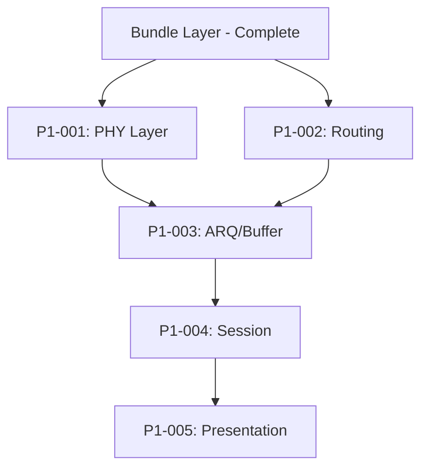

# P1-000: Core Networking & DTN Protocols Epic

**Epic Owner:** Pair 1  
**Priority:** Critical  
**Total Story Points:** 52  
**Timeline:** 3-4 weeks  
**Status:** Ready for Implementation

## Epic Overview

Implement the complete DTN networking stack from Physical layer abstraction through Transport layer protocols, including multiple routing algorithms, ARQ mechanisms, buffer management, and integration with satellite communication models. Build upon the completed Bundle layer foundation to create a production-ready DTN simulator.

## Business Value

This epic enables comprehensive DTN protocol implementation with:
- **Multi-layer OSI Model Implementation** - Physical through Transport layers
- **Advanced DTN Routing** - Multiple algorithms with performance comparison
- **Reliable Communication** - ARQ and buffer management for satellite networks
- **Protocol Integration** - Seamless connectivity with satellite mobility and GUI systems
- **Academic Research Foundation** - Platform for DTN algorithm analysis and comparison

## Epic Goals

1. **Protocol Stack:** Complete DTN networking implementation across OSI layers 1-4
2. **Routing Intelligence:** Multiple routing algorithms with contact-aware optimization
3. **Reliability:** ARQ and buffer management for intermittent satellite connectivity
4. **Integration:** APIs for satellite mobility (Pair 2) and visualization (Pair 3)
5. **Performance:** Real-time operation supporting large satellite constellations

## Tickets in Epic

### ✅ **Completed Foundation**
- **Bundle Layer Implementation** - DTN Bundle protocol with satellite-specific features (93% test coverage)

### **Critical Path (Active Development)**
- **P1-001: Implement PHY Abstraction Layer** (8 pts) - *Physical Layer Foundation*
  - Satellite communication channel modeling
  - Link capacity calculations and contact window integration
  - Signal propagation and antenna models

- **P1-002: Implement DTN Routing Algorithms** (15 pts) - *Network Layer Core*
  - Epidemic routing with flooding control
  - PRoPHET routing with contact prediction
  - Spray-and-Wait routing with copy management

- **P1-003: Implement ARQ and Buffer Management** (12 pts) - *Data Link Layer*
  - Stop-and-wait or sliding window ARQ
  - Buffer drop policies (oldest/largest/random)
  - Flow control and congestion management

### **High Priority (Network Stack)**
- **P1-004: Implement Session and Connection Management** (10 pts) - *Session Layer*
  - Contact session establishment and teardown
  - Connection state management across network partitions
  - Session recovery and reconnection handling

### **Medium Priority (Advanced Features)**
- **P1-005: Implement Presentation Layer Services** (7 pts) - *Data Processing*
  - Bundle payload encoding/decoding
  - Data compression for bandwidth optimization
  - Optional encryption for secure communications

## Dependencies

### External Dependencies
- **Pair 2 (Satellite Mobility):** Contact window predictions, satellite positions, mobility state
- **Pair 3 (GUI):** Real-time network visualization, performance metrics display

### Internal Dependencies


## Technical Architecture

### OSI Layer Implementation

#### **Physical Layer (P1-001)**
```python
class SatellitePhysicalLayer:
    def calculate_link_capacity(contact_window, satellite_range, frequency)
    def model_signal_propagation(transmitter, receiver, environment)
    def estimate_bit_error_rate(signal_strength, noise_level)
    def manage_antenna_pointing(satellite_position, ground_station)
```

#### **Data Link Layer (P1-003)**
```python
class DTNDataLink:
    def send_with_arq(bundle, contact_window, arq_type="stop_and_wait")
    def manage_buffer(buffer_policy="oldest_first", max_size_mb=80)
    def handle_contact_interruption(partial_transmission)
    def detect_and_correct_errors(received_data)
```

#### **Network Layer (P1-002)**
```python
class DTNRouting:
    def epidemic_route(bundle, neighbor_nodes, infection_rate)
    def prophet_route(bundle, contact_history, delivery_predictability)
    def spray_and_wait_route(bundle, copy_count, encounter_history)
    def select_best_next_hop(bundle, available_contacts, routing_algorithm)
```

#### **Session Layer (P1-004)**
```python
class DTNSession:
    def establish_contact_session(satellite, ground_station, contact_window)
    def manage_session_state(session_id, connection_status)
    def handle_partition_recovery(lost_sessions, available_contacts)
    def coordinate_multi_hop_sessions(route_path, bundle_flow)
```

#### **Presentation Layer (P1-005)**
```python
class DTNPresentation:
    def encode_payload(data, encoding_type="utf-8", compression=True)
    def compress_bundle(bundle, algorithm="gzip", target_ratio=0.7)
    def encrypt_payload(data, encryption_key, algorithm="AES-256")
    def decode_received_bundle(encoded_bundle, decryption_key)
```

## Success Criteria

### Functional Requirements
- [ ] All 3 routing algorithms operational with performance metrics
- [ ] ARQ provides reliable delivery over intermittent satellite links
- [ ] Buffer management prevents memory overflow during congestion
- [ ] Session management handles network partitions gracefully
- [ ] Presentation layer optimizes bandwidth utilization

### Performance Requirements
- [ ] Routing decision: < 50ms per bundle
- [ ] ARQ retransmission delay: < 100ms
- [ ] Buffer operations: < 10ms per bundle
- [ ] Session establishment: < 200ms
- [ ] Real-time operation with 100+ satellites

### Integration Requirements
- [ ] Seamless integration with Pair 2 satellite mobility APIs
- [ ] Real-time data feeds to Pair 3 visualization system
- [ ] Contact window utilization > 80% efficiency
- [ ] Support for all constellation types (LEO/MEO/GEO/HEO)

### Quality Requirements
- [ ] >85% test coverage across all networking modules
- [ ] All code passes linting (flake8) and type checking (mypy)
- [ ] Protocol compliance with DTN standards
- [ ] Performance benchmarks documented and validated

## Risk Assessment

### High Risk
- **Routing Algorithm Complexity:** PRoPHET and Spray-and-Wait require sophisticated state management
  - *Mitigation:* Implement Epidemic routing first as foundation, add complexity incrementally
  - *Contingency:* Focus on Epidemic + one additional algorithm for MVP

### Medium Risk
- **Real-time Performance:** Large constellations may challenge routing performance
  - *Mitigation:* Profile early, optimize critical paths, implement routing caches
  - *Contingency:* Implement constellation size limits for real-time guarantees

### Low Risk
- **Integration Complexity:** APIs with Pair 2 and Pair 3 need careful coordination
  - *Mitigation:* Define clear interfaces early, implement mock services for testing

## Timeline

### Week 1: Physical Layer Foundation
- **Days 1-3:** P1-001 (PHY Abstraction Layer) - Channel modeling and link calculations
- **Days 4-5:** Begin P1-002 (Routing) - Epidemic routing implementation

### Week 2: Core Routing Implementation
- **Days 1-3:** Complete P1-002 (Routing) - PRoPHET and Spray-and-Wait algorithms
- **Days 4-5:** Begin P1-003 (ARQ/Buffer) - Stop-and-wait ARQ

### Week 3: Reliability and Session Management
- **Days 1-2:** Complete P1-003 (ARQ/Buffer) - Buffer policies and flow control
- **Days 3-5:** P1-004 (Session Management) - Contact session handling

### Week 4: Advanced Features and Integration
- **Days 1-2:** P1-005 (Presentation Layer) - Encoding and compression
- **Days 3-5:** Integration testing, performance optimization, documentation

## Deliverables

### Code Deliverables
- [ ] 5 networking modules with comprehensive implementation
- [ ] Complete test suite with >85% coverage
- [ ] Integration tests with Pair 2 and Pair 3 components
- [ ] Performance benchmarks and optimization reports

### Protocol Deliverables
- [ ] DTN routing algorithm implementations with performance comparison
- [ ] ARQ protocol supporting satellite communication patterns
- [ ] Buffer management policies optimized for space networks
- [ ] Session management handling network partitions

### Integration Deliverables
- [ ] APIs for satellite mobility integration (Pair 2)
- [ ] Real-time data feeds for GUI visualization (Pair 3)
- [ ] Contact window utilization optimization
- [ ] Multi-constellation support validation

## Integration Points

### With Pair 2 (Satellite Mobility)
```python
# Contact window integration
contact_windows = mobility_model.get_current_contacts(timestamp)
routing_decision = dtn_router.select_next_hop(bundle, contact_windows)

# Satellite position for link calculations
satellite_pos = mobility_model.get_node_position("SAT_001", timestamp)
link_capacity = phy_layer.calculate_link_capacity(satellite_pos, ground_station)
```

### With Pair 3 (GUI Visualization)
```python
# Real-time routing visualization
routing_paths = dtn_router.get_active_routes()
gui.update_routing_visualization(routing_paths)

# Buffer status for dashboard
buffer_stats = buffer_manager.get_utilization_stats()
gui.update_buffer_status_bars(buffer_stats)
```

## Resources

### Technical References
- **RFC 5050:** Bundle Protocol Specification
- **RFC 4838:** Delay-Tolerant Networking Architecture
- **Academic Papers:** PRoPHET, Spray-and-Wait algorithm specifications
- **Satellite Communication:** Link budget calculations and RF propagation models

### Development Tools
- **Python Libraries:** asyncio for concurrent operations, numpy for calculations
- **Testing Tools:** pytest, coverage, hypothesis for property-based testing
- **Performance:** Python profiling tools, memory usage monitoring
- **Validation:** Network simulation comparison tools

## Acceptance Criteria

### Epic Completion Criteria
- [ ] All 5 tickets completed and tested
- [ ] Complete DTN protocol stack operational
- [ ] Integration with Pair 2 (mobility) verified
- [ ] Integration with Pair 3 (GUI) verified
- [ ] Performance meets real-time requirements
- [ ] Code quality meets project standards
- [ ] Documentation complete and reviewed

### Demo Requirements
- [ ] Live demonstration of all 3 routing algorithms
- [ ] ARQ reliability over simulated satellite links
- [ ] Buffer management under congestion scenarios
- [ ] Session recovery after network partitions
- [ ] Real-time operation with large constellation

---

**Built on the solid foundation of the completed Bundle layer to deliver enterprise-grade DTN networking capabilities** 🌐

*Ready to demonstrate advanced DTN protocol implementation across the complete networking stack.*