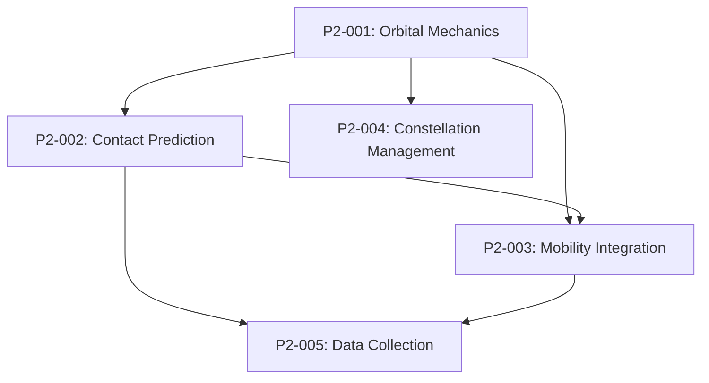

# P2-000: Satellite Mobility & Data Collection Epic

**Epic Owner:** Pair 2  
**Priority:** Critical  
**Total Story Points:** 44  
**Timeline:** 2-3 weeks  
**Status:** Ready for Development

## Epic Overview

Implement comprehensive satellite mobility and data collection functionality for the DTN simulator, including orbital mechanics calculations, contact window prediction, mobility model integration, constellation management, and experiment data collection framework.

## Business Value

This epic enables the DTN simulator to accurately model satellite networks, providing the foundation for:
- **Realistic satellite network simulation** with proper orbital mechanics
- **Contact-aware DTN routing** based on predicted communication windows
- **Comprehensive experiment data collection** for research and analysis
- **Flexible constellation configuration** supporting various satellite network topologies
- **Integration with GUI and routing algorithms** for complete system functionality

## Epic Goals

1. **Foundation:** Accurate orbital mechanics and position calculations
2. **Connectivity:** Reliable contact window prediction between satellites and ground stations  
3. **Integration:** Seamless mobility model integration with DTN framework
4. **Flexibility:** Support for multiple constellation types and custom configurations
5. **Analysis:** Comprehensive data collection for performance evaluation

## Tickets in Epic

### Critical Path (Must Complete First)
- **P2-001: Implement Core Orbital Mechanics Calculations** (8 pts) - *Foundation*
  - Orbital period, velocity, and propagation calculations
  - Coordinate system transformations (ECI, ECEF, geodetic)
  - Ground track calculations

### High Priority (Depends on P2-001)
- **P2-002: Implement Contact Window Prediction System** (13 pts) - *Core Functionality*
  - Line-of-sight calculations and visibility determination
  - Contact window prediction algorithms
  - Contact quality metrics and scheduling

- **P2-003: Implement Satellite Mobility Model Integration** (10 pts) - *System Integration*
  - Mobility state management and position updates
  - CSV contact plan import/export
  - Real-time position updates for GUI

### Medium Priority (Parallel Development)
- **P2-004: Implement Constellation Configuration Management** (8 pts) - *Configuration*
  - Preset constellation generation (LEO, MEO, GEO, HEO)
  - Custom constellation builder
  - JSON configuration import/export

- **P2-005: Implement Experiment Data Collection Framework** (5 pts) - *Analysis Support*
  - Mobility and contact event logging
  - Network state snapshots
  - Data export for analysis tools

## Dependencies

### External Dependencies
- **Pair 1 (Core Networking):** DTN bundle system and routing framework
- **Pair 3 (GUI):** Real-time position updates and contact visualization

### Internal Dependencies


## Technical Architecture

### Module Structure
```
src/satellite/
├── orbital_mechanics.py      # P2-001: Core calculations
├── contact_prediction.py     # P2-002: Contact windows  
├── satellite_mobility.py     # P2-003: Mobility integration
├── constellation_config.py   # P2-004: Configuration management
└── experiment_data.py        # P2-005: Data collection
```

### Key Integration Points
1. **With DTN Routing:** Current node positions and contact predictions
2. **With GUI:** Real-time satellite positions and contact visualization
3. **With Experiment Framework:** Mobility logs and performance data

## Success Criteria

### Functional Requirements
- [ ] Accurate satellite position calculations (±1km for LEO)
- [ ] Contact window predictions match orbital mechanics theory
- [ ] Real-time position updates support GUI animation (1-10 Hz)
- [ ] Support for all major constellation types (LEO, MEO, GEO, HEO)
- [ ] CSV contact plans compatible with external network tools
- [ ] Comprehensive experiment data collection and export

### Performance Requirements
- [ ] Single satellite position calculation: < 10ms
- [ ] Contact prediction for 24 hours: < 30 seconds
- [ ] Real-time updates for 100+ satellites: < 100ms
- [ ] Memory usage: < 100MB for extended simulations
- [ ] Data collection overhead: < 5% of simulation time

### Quality Requirements
- [ ] >85% test coverage across all modules
- [ ] All code passes linting (flake8) and type checking (mypy)
- [ ] Comprehensive documentation with examples
- [ ] Validation against known satellite tracking data

## Risk Assessment

### High Risk
- **Orbital mechanics complexity:** Accurate implementation requires deep understanding
  - *Mitigation:* Extensive validation against known satellite data
  - *Contingency:* Use simplified models for MVP, enhance later

### Medium Risk
- **Performance with large constellations:** Starlink-scale (1584 satellites) may be slow
  - *Mitigation:* Optimize critical path calculations, use caching
  - *Contingency:* Implement constellation size limits for real-time operation

### Low Risk
- **Integration complexity:** Multiple modules must work together seamlessly
  - *Mitigation:* Clear interfaces and comprehensive integration testing

## Timeline

### Week 1: Foundation
- **Days 1-4:** P2-001 (Orbital Mechanics Core) - Critical path
- **Days 3-5:** Begin P2-002 (Contact Prediction) - Parallel start

### Week 2: Core Functionality  
- **Days 1-2:** Complete P2-002 (Contact Prediction)
- **Days 3-5:** P2-003 (Mobility Integration)
- **Days 4-5:** Begin P2-004 (Constellation Management) - Parallel

### Week 3: Integration & Polish
- **Days 1-2:** Complete P2-004 (Constellation Management)
- **Days 2-3:** P2-005 (Experiment Data Collection)
- **Days 4-5:** Integration testing, performance optimization, documentation

## Deliverables

### Code Deliverables
- [ ] 5 fully implemented satellite modules with comprehensive TODO completion
- [ ] Complete test suite with >85% coverage
- [ ] Integration tests with other pairs' components
- [ ] Performance benchmarks and optimization

### Documentation Deliverables
- [ ] API documentation for all public interfaces
- [ ] Usage examples and tutorials
- [ ] Configuration file format specifications
- [ ] Integration guide for other development pairs

### Data Deliverables
- [ ] Preset constellation configurations (JSON)
- [ ] Sample contact plans (CSV) for testing
- [ ] Validation datasets with known satellite tracking data
- [ ] Performance benchmark results

## Acceptance Criteria

### Epic Completion Criteria
- [ ] All 5 tickets completed and tested
- [ ] End-to-end satellite simulation working
- [ ] Integration with Pair 1 (DTN routing) verified
- [ ] Integration with Pair 3 (GUI) verified  
- [ ] Performance meets all specified requirements
- [ ] Code quality meets project standards
- [ ] Documentation complete and reviewed

### Demo Requirements
- [ ] Live demonstration of satellite constellation
- [ ] Real-time contact window visualization
- [ ] CSV export/import of contact plans
- [ ] Performance metrics display
- [ ] Integration with DTN routing decisions

## Resources

### Technical References
- **Vallado's "Fundamentals of Astrodynamics"** - Orbital mechanics authority
- **Curtis's "Orbital Mechanics for Engineering Students"** - Practical approach
- **NASA GMAT** - Free orbital analysis software for validation
- **CelesTrak** - TLE data source for real satellite validation

### Development Tools
- **Python Libraries:** numpy, scipy, skyfield for calculations
- **Testing Tools:** pytest, coverage for quality assurance
- **Validation:** Online orbital calculators, satellite tracking websites
- **Performance:** Python profiling tools for optimization

## Notes

This epic represents the foundation of satellite network simulation capability. Success here enables realistic DTN satellite network research and provides the mobility framework that other pairs depend on for GUI visualization and routing algorithm development.