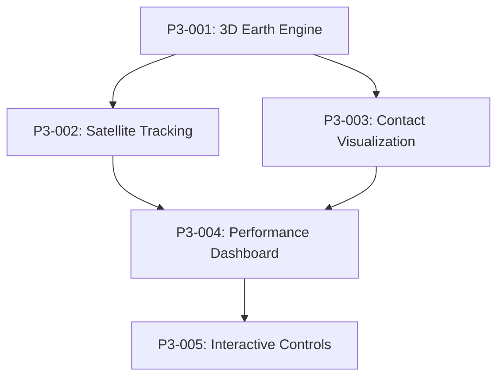

# P3-000: GUI & Visualization Epic

**Epic Owner:** Pair 3  
**Priority:** Critical  
**Total Story Points:** 48  
**Timeline:** 3-4 weeks  
**Status:** Ready for Development

## Epic Overview

Implement comprehensive 3D visualization and user interface for the DTN satellite simulator, including real-time Earth globe rendering, satellite tracking, contact window visualization, performance dashboards, and interactive controls. Create an engaging and informative interface that showcases the complexity and beauty of satellite DTN networks.

## Business Value

This epic enables immersive satellite network visualization with:
- **3D Earth Visualization** - Professional-grade globe rendering with satellite tracking
- **Real-Time Network Monitoring** - Live contact windows, routing paths, and performance metrics
- **Interactive Control Systems** - Constellation editing, simulation control, and experiment configuration
- **Academic Presentation** - Publication-quality visualizations for research and demonstration
- **User Experience Excellence** - Intuitive interface showcasing technical sophistication

## Epic Goals

1. **Visual Excellence:** Stunning 3D Earth visualization with realistic satellite motion
2. **Real-Time Monitoring:** Live network state with contact windows and routing visualization
3. **Interactive Control:** User-friendly constellation editing and simulation management
4. **Performance Dashboard:** Comprehensive metrics display for experiment analysis
5. **Academic Quality:** Publication-ready visualizations for research presentation

## Tickets in Epic

### **Critical Path (3D Foundation)**
- **P3-001: Implement 3D Earth Visualization Engine** (12 pts) - *Core 3D Foundation*
  - Earth globe rendering with geographic textures
  - Camera system with orbital viewing angles
  - Coordinate system transformations
  - Performance-optimized rendering pipeline

- **P3-002: Implement Real-Time Satellite Tracking** (10 pts) - *Dynamic Visualization*
  - Satellite position rendering and orbital motion
  - Ground track visualization and prediction
  - Constellation display with multiple orbit types
  - Smooth animation with time acceleration

### **High Priority (Network Visualization)**
- **P3-003: Implement Contact Window Visualization** (8 pts) - *Communication Links*
  - Active contact beam rendering between satellites and ground stations
  - Contact timeline Gantt charts per node
  - Link quality visualization (signal strength, data rate)
  - Future contact prediction display

- **P3-004: Implement Performance Dashboard** (10 pts) - *Metrics & Analysis*
  - Real-time delivery ratio, delay CDF, overhead tracking
  - Buffer utilization bars per satellite/ground station
  - Routing algorithm performance comparison
  - Network topology graphs with message flows

### **Medium Priority (User Interface)**
- **P3-005: Implement Interactive Controls** (8 pts) - *User Interface*
  - Simulation control panel (play/pause/speed/reset)
  - Constellation selection and editing interface
  - Experiment configuration and parameter adjustment
  - Data export controls and format selection

## Dependencies

### External Dependencies
- **Pair 1 (Core Networking):** Real-time routing data, buffer states, performance metrics
- **Pair 2 (Satellite Mobility):** Satellite positions, contact windows, mobility states

### Internal Dependencies


## Technical Architecture

### 3D Visualization Stack

#### **Rendering Engine (P3-001)**
```python
class Earth3DRenderer:
    def render_earth_globe(texture_resolution="4K", atmosphere_effects=True)
    def setup_camera_system(orbital_view=True, free_flight=True)
    def transform_coordinates(eci_to_screen, geodetic_to_3d)
    def optimize_rendering_pipeline(target_fps=60, max_objects=2000)
```

#### **Satellite Visualization (P3-002)**
```python
class SatelliteTracker:
    def render_satellite_positions(constellation, timestamp, animation_smooth=True)
    def display_ground_tracks(satellite_id, prediction_hours=24)
    def animate_orbital_motion(time_acceleration=1.0, orbital_trails=True)
    def handle_constellation_switching(new_constellation, transition_time=2.0)
```

#### **Network Visualization (P3-003)**
```python
class ContactVisualizer:
    def render_active_contacts(contact_beams=True, signal_strength_color=True)
    def display_contact_timeline(gantt_chart=True, node_filtering=True)
    def show_future_contacts(prediction_window=6.0, probability_coloring=True)
    def animate_message_flows(bundle_paths=True, transmission_beams=True)
```

#### **Dashboard System (P3-004)**
```python
class PerformanceDashboard:
    def update_delivery_metrics(delivery_ratio, delay_cdf, overhead_ratio)
    def display_buffer_utilization(per_node_bars=True, network_heatmap=True)
    def show_routing_performance(algorithm_comparison=True, real_time=True)
    def render_network_topology(graph_layout="force_directed", message_flows=True)
```

#### **User Interface (P3-005)**
```python
class SimulationControls:
    def simulation_playback_controls(play, pause, reset, time_acceleration)
    def constellation_editor(preset_selection, custom_editing, parameter_validation)
    def experiment_configuration(scenario_templates, parameter_adjustment)
    def data_export_interface(csv_export, json_export, screenshot_capture)
```

## Success Criteria

### Visual Quality Requirements
- [ ] 60 FPS rendering with 1000+ satellites displayed simultaneously
- [ ] Photorealistic Earth rendering with day/night cycle
- [ ] Smooth satellite animation with accurate orbital mechanics
- [ ] Professional-quality contact beam visualization
- [ ] Publication-ready screenshot and video export

### Functionality Requirements
- [ ] Real-time position updates from Pair 2 mobility system
- [ ] Live network metrics from Pair 1 routing algorithms
- [ ] Interactive constellation editing with parameter validation
- [ ] Time acceleration from 1x to 10,000x with smooth transitions
- [ ] Multiple camera angles (orbital, satellite-following, ground-based)

### Performance Requirements
- [ ] Sub-16ms frame rendering (60 FPS target)
- [ ] < 2GB memory usage with largest constellations
- [ ] Real-time responsiveness to user interactions
- [ ] Smooth animation during time acceleration
- [ ] Efficient batch updates for position data

### Integration Requirements
- [ ] Seamless integration with Pair 2 satellite position APIs
- [ ] Real-time data consumption from Pair 1 networking stack
- [ ] Configuration export compatible with simulation framework
- [ ] Performance data export for external analysis tools

## Technology Stack

### 3D Graphics Framework
**Primary Option: Three.js with React**
- **Pros:** Mature WebGL framework, excellent documentation, React integration
- **Cons:** JavaScript performance limitations for large datasets
- **Use Case:** Web-based interface, cross-platform compatibility

**Alternative: Unity with C#**
- **Pros:** Superior performance, advanced rendering pipeline, asset management
- **Cons:** Larger deployment, integration complexity with Python backend
- **Use Case:** Desktop application, maximum performance requirements

**Recommended:** Start with Three.js for rapid development, evaluate Unity for performance-critical scenarios

### UI Framework
```javascript
// React + Three.js integration
const SatelliteSimulator = () => {
  return (
    <div className="simulator-container">
      <Canvas camera={{ position: [0, 0, 50000] }}>
        <EarthGlobe />
        <Satelliteconstellation={satellites} />
        <ContactBeams contacts={activeContacts} />
      </Canvas>
      <ControlPanel />
      <MetricsDashboard />
    </div>
  );
};
```

### Data Integration
```python
# WebSocket API for real-time data
class GuiDataProvider:
    def stream_satellite_positions(websocket, update_rate_hz=10)
    def stream_contact_windows(websocket, prediction_hours=24)
    def stream_performance_metrics(websocket, metrics_types)
    def handle_user_commands(websocket, command_type, parameters)
```

## Implementation Phases

### Phase 1: 3D Foundation (P3-001)
**Week 1: Core 3D Engine**
- Earth globe rendering with texture mapping
- Camera system with orbital controls
- Basic coordinate transformations
- Performance optimization baseline

**Deliverables:**
- Rotating Earth with realistic textures
- Smooth camera controls (zoom, pan, rotate)
- Coordinate system validation
- 60 FPS performance benchmark

### Phase 2: Satellite Tracking (P3-002)
**Week 2: Dynamic Satellite Visualization**
- Real-time satellite position rendering
- Orbital motion animation with time acceleration
- Ground track display and prediction
- Multiple constellation support

**Deliverables:**
- Live satellite tracking from Pair 2 data
- Smooth orbital animation (1x to 1000x speed)
- Historical ground track display
- Constellation switching capability

### Phase 3: Network Visualization (P3-003)
**Week 2-3: Communication Links**
- Active contact beam rendering
- Contact timeline Gantt charts
- Signal quality visualization
- Message flow animation

**Deliverables:**
- Real-time contact beam display
- Interactive contact timeline
- Link quality color coding
- Animated bundle transmission paths

### Phase 4: Performance Dashboard (P3-004)
**Week 3: Metrics and Analysis**
- Real-time performance metrics display
- Buffer utilization visualization
- Routing algorithm comparison
- Network topology graphs

**Deliverables:**
- Live delivery ratio and delay metrics
- Per-satellite buffer status bars
- Routing performance comparison charts
- Dynamic network topology visualization

### Phase 5: User Interface (P3-005)
**Week 4: Interactive Controls**
- Simulation control panel
- Constellation editing interface
- Experiment configuration
- Data export functionality

**Deliverables:**
- Complete simulation controls
- Constellation preset selection and editing
- Experiment parameter configuration
- CSV/JSON data export with screenshots

## Testing Strategy

### Visual Testing
- **Screenshot Comparison:** Automated visual regression testing
- **Performance Benchmarking:** Frame rate and memory usage validation
- **Cross-Platform Testing:** Browser compatibility and mobile responsiveness
- **User Acceptance Testing:** Interface usability and workflow validation

### Integration Testing
- **Real-Time Data:** Validate data streams from Pair 1 and Pair 2
- **API Compatibility:** Test all integration points and error handling
- **Stress Testing:** Large constellation performance validation
- **Concurrent Users:** Multi-user simulation support

### Functional Testing
```python
def test_satellite_tracking():
    # Validate satellite positions match orbital mechanics
    calculated_position = orbital_mechanics.propagate_orbit(elements, time)
    displayed_position = gui.get_satellite_position(satellite_id)
    assert_positions_match(calculated_position, displayed_position, tolerance=1.0)

def test_contact_visualization():
    # Verify contact beams match predicted windows
    predicted_contacts = contact_predictor.get_current_contacts(time)
    displayed_contacts = gui.get_active_contact_beams()
    assert_contacts_match(predicted_contacts, displayed_contacts)
```

## Risk Assessment

### High Risk
- **Performance with Large Constellations:** 1584 satellites may challenge rendering performance
  - *Mitigation:* Level-of-detail (LOD) rendering, object culling, efficient batch updates
  - *Contingency:* Implement constellation size limits, optimize for smaller constellations

### Medium Risk
- **Real-Time Data Integration:** WebSocket performance and reliability with high-frequency updates
  - *Mitigation:* Implement data buffering, adaptive update rates, connection recovery
  - *Contingency:* Fallback to polling-based updates with reduced frequency

### Low Risk
- **3D Framework Learning Curve:** Team familiarity with Three.js and WebGL
  - *Mitigation:* Start with tutorials and simple examples, incremental complexity
  - *Contingency:* Use 2D fallback visualization for critical demo scenarios

## Deliverables

### Code Deliverables
- [ ] 5 visualization modules with comprehensive implementation
- [ ] Complete UI test suite with visual regression testing
- [ ] Integration tests with Pair 1 and Pair 2 APIs
- [ ] Performance benchmarks and optimization documentation

### Visual Deliverables
- [ ] 3D Earth visualization with satellite constellation display
- [ ] Real-time contact window and network performance visualization
- [ ] Interactive constellation editing and simulation controls
- [ ] Publication-quality screenshots and demonstration videos

### Documentation Deliverables
- [ ] User interface guide and tutorial
- [ ] API integration specifications
- [ ] Performance optimization techniques
- [ ] Visual design guidelines and assets

## Acceptance Criteria

### Epic Completion Criteria
- [ ] All 5 tickets completed and tested
- [ ] 3D visualization operational with real-time data integration
- [ ] Integration with Pair 1 (networking) verified
- [ ] Integration with Pair 2 (mobility) verified
- [ ] Performance meets 60 FPS requirements
- [ ] User interface intuitive and feature-complete
- [ ] Code quality meets project standards

### Demo Requirements
- [ ] Live 3D satellite constellation demonstration
- [ ] Real-time contact window visualization
- [ ] Interactive constellation editing
- [ ] Performance metrics dashboard
- [ ] Time acceleration and simulation controls
- [ ] Professional presentation quality

---

**Creating an immersive and technically sophisticated visualization platform that showcases the beauty and complexity of satellite DTN networks** 🌍🛰️

*Ready to deliver a world-class user interface that demonstrates advanced 3D visualization and real-time network monitoring capabilities.*